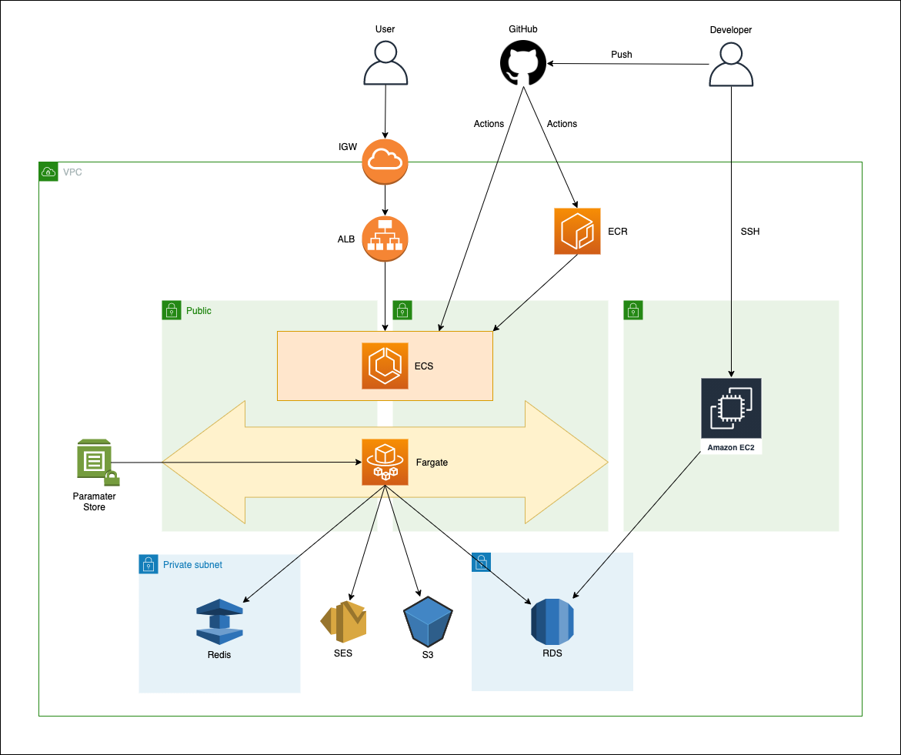

## 概要
laravel-cmsリポジトリのインフラ環境です。
※ Publicサブネットに置いている事に抵抗がある方はNatGatewayを作成し、Purivateサブネットに移行してください。

## 構成図


## 作成手順

1. .envの作成
    ```
    $ cp .env.example .env 
    ```

1. .envに環境変数のセット

1. コンテナを立ち上げてterraformのコンテナの中に入る
    ```
    $ docker-compose up -d
    $ docker-compose exec terraform /bin/ash
    ```
1. モジュールの読み込み
    ```
    # terraform init
    ```
   
1. 環境の作成
    ```
    # terraform apply 
    ```